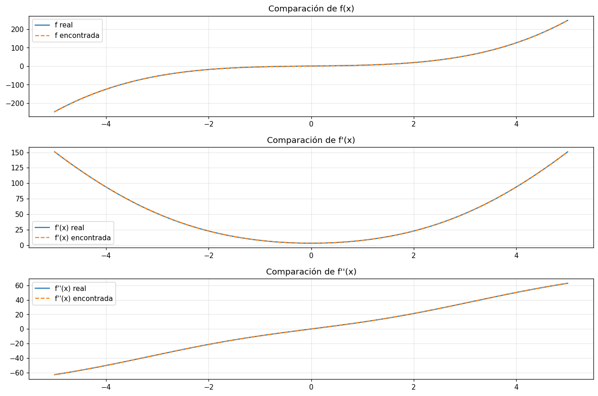

# Function-Aprox — Regresión Simbólica Evolutiva en GPU

[](https://colab.research.google.com/github/Demonio0N1/Symbolic-Function-Aproximation/blob/main/FunctionAprox_GPU_Symbolic_AOS_PLUS.ipynb)

Aproxima una función matemática a partir de datos `(X, Y)` y devuelve una
**expresión analítica interpretable** (por ejemplo `2*x**3 + 3*sin(x) + 1`),
combinando programación genética con selección adaptativa de operadores (AOS),
evaluación por lotes en GPU, islas con migración, ajuste fino de constantes con
Adam y exportación a SymPy.



## Quickstart

```bash
pip install -r requirements.txt   # torch con CUDA para GPU (opcional: funciona en CPU)
```

```python
import numpy as np
import symreg

X = np.linspace(-5, 5, 400).astype(np.float32)
Y = (2*X**3 + 3*np.sin(X) + 1).astype(np.float32)

cat_un, cat_bin = symreg.build_catalogs(["sin", "cos", "log", "sqrt", "abs", "neg"],
                                        ["add", "sub", "mul", "div", "pow"])
best, fit, hist, aos, hof = symreg.evolve_islands(
    X, Y, cat_un, cat_bin, n_islands=4, generations=250, pop_size=160,
    val_fraction=0.2, restart_patience=80)
hof = symreg.fine_tune_hof(hof, X, Y)          # constantes de todo el Hall of Fame en paralelo
best = symreg.recognize_constants(hof.items[0][1], X, Y)   # 2.9999 -> 3, pi, fracciones

f_sym, x = symreg.to_sympy(best)               # expresión SymPy (derivable/integrable)
symreg.save_tree(best, "mejor_expresion.json") # serialización JSON
```

El notebook `FunctionAprox_GPU_Symbolic_AOS_PLUS.ipynb` es una demo delgada de
este flujo (con la configuración por defecto recupera el caso de prueba en ~2
minutos en una RTX 4090). `X` puede ser `(n,)` o `(n, n_vars)` (multivariable).

## Interfaz web local

```bash
./webapp/run.sh          # -> http://localhost:8000
# equivalente: uvicorn webapp.app:app --port 8000
```

Corre en tu máquina y usa la GPU a través de `symreg`. Desde el navegador puedes:

- elegir el objetivo: **preset** (los 8 benchmarks), **expresión** `y=f(x)`
  escrita a mano (numpy) o **CSV** propio (multivariable: columnas `x1..xk, y`),
  con ruido gaussiano opcional;
- configurar población, generaciones, islas, profundidad, catálogo de
  operadores (checkboxes), NSGA-II, validación, reinicios y modo EML;
- seguir el **progreso en vivo** (barra, mejor fitness, convergencia) y
  **cancelar** conservando el resultado parcial;
- ver la expresión (motor, SymPy y LaTeX), MSE de train/validación, gráfica de
  ajuste, Hall of Fame y frente de Pareto;
- descargar el árbol JSON y el checkpoint de la corrida.

Una corrida a la vez (la GPU es una); la evolución se ejecuta por bloques de
generaciones, así que la cancelación tarda como mucho un bloque.

## Estructura del paquete

| Módulo | Contenido |
|--------|-----------|
| `symreg.config` | Todos los flags (mutables en runtime) + `set_seed` |
| `symreg.backend` | torch (CPU/CUDA), guardas numéricas, operadores elementales |
| `symreg.tree` | Clases de nodo, `to_sympy` recursivo, simplificación, serialización JSON |
| `symreg.ops` | Catálogos de operadores y mapeos para el intérprete por lotes |
| `symreg.aos` | Selección adaptativa de operadores (softmax + poda) |
| `symreg.evolve` | `evolve`, `evolve_islands`, fitness, intérprete plano por lotes, Hall of Fame, NSGA-II |
| `symreg.finetune` | Adam sobre constantes (individual y HoF en paralelo), reconocimiento de constantes |
| `symreg.eml` | Modo EML puro: `eml(x,y) = exp(x) - ln(y)` con multi-starts por lotes |
| `symreg.export` | Exportación a SymPy, roundtrip numérico, lambdify robusto |
| `symreg.checkpoint` | Checkpoints de corridas largas (JSON) |
| `symreg.benchmarks` | Suite Nguyen/Keijzer/Feynman (ver `BENCHMARKS.md`) |

Tests: `pytest tests/` (24 tests; pasan en GPU y en CPU con `CUDA_VISIBLE_DEVICES=""`).

## Rendimiento GPU (RTX 4090)

El código original era CPU-bound: 577k lanzamientos de kernel y ~3.200
sincronizaciones CPU-GPU por generación (un `.item()` por individuo). El
intérprete plano por lotes aplana la población a un DAG y evalúa cada nivel
agrupando por operador, con una sincronización por lote.

| Configuración (POP=160, GEN=120) | ms/gen | Speedup |
|----------------------------------|-------:|--------:|
| Original (sin caché, sin lotes) | 2349 | x1,0 |
| + caché de fitness | 734 | x3,2 |
| + lotes, `AOS_UPDATE_CHUNK=1` (fiel) | 429 | x5,5 |
| + lotes, `AOS_UPDATE_CHUNK=16` | 149 | x15,8 |

Caso completo `2x³+3sin(x)+1` (POP=160, GEN=1000): **440,7 s → 109,3 s** (fiel)
o ~77 s (chunk=16). Con 4 islas y GEN=250: recuperación **5/5 semillas en ~120 s**
(el original: 2/5 en ~440 s). Evaluado y descartado con datos: `torch.compile`
en el bucle evolutivo (recompila con cada población; sí se usa en el modo EML
puro de estructura fija); `float64` cuesta solo x1,26 (`config.DTYPE`).

Nota de reproducibilidad: con `BATCH_EVAL=False` la trayectoria es bit-exacta
respecto al código original; la evaluación por lotes cambia el orden de
reducción del MSE (±1 ulp) y puede divergir tras decenas de generaciones aunque
el algoritmo sea el mismo.

**Backend:** el paquete es torch-only. Se retiró CuPy con datos: solo disponía
de la ruta clásica recursiva (~x10 más lenta que el intérprete por lotes),
torch cubre CPU y CUDA con el mismo código, y cada helper estaba duplicado.

## Calidad de búsqueda

- **Islas con migración** (`evolve_islands`): 4×160 con migración en anillo
  cada 50 generaciones — el mayor salto de tasa de recuperación medido.
- **NSGA-II** (`config.SELECTION="nsga2"`): frente de Pareto precisión vs
  complejidad completo en `hof.pareto`.
- **Validación** (`val_fraction`): el mejor final se elige por MSE de validación.
- **Reinicios por estancamiento** y early stopping.
- **AOS**: recompensas también para el crossover (operadores del subárbol
  donado) y normalizadas por la varianza de Y. Diagnóstico clave de la Fase 2:
  el AOS necesita recompensas casi inmediatas — diferirlas al final de la
  generación degrada la búsqueda.
- **Reconocimiento de constantes**: `2.9999*sin(x) → 3*sin(x)` (round +
  `sympy.nsimplify` con π, e y fracciones), aceptando solo si el MSE no empeora.

## Operador EML

`eml(x,y) = exp(x) - ln(y)` genera todas las funciones elementales
(A. Odrzywołek, *All elementary functions from a single binary operator*,
arXiv:2603.21852, sección 4.3 para regresión simbólica).

- `config.EML_MODE="operator"`: `Eml` entra al catálogo y el AOS lo pondera.
- `config.EML_MODE="pure"`: gramática `S -> hoja_afin | eml(S,S)` con hojas
  `αᵢ + βᵢ·x` entrenadas por Adam; los multi-starts van **por lotes** (dimensión
  extra del tensor) porque la init aleatoria falla a profundidad > 4 — se
  confirmó: 256/256 reinicios divergen sin las guardas — y una evolución corta
  eml-only inicializa los pesos (subárboles no-eml → hojas afines por mínimos
  cuadrados en GPU).
- `to_sympy` muestra eml compacto o expandido a `exp/ln`
  (`config.EML_SYMPY_EXPAND`).

## Benchmarks (Fase 5)

8 objetivos × 3 configuraciones × 5 semillas en RTX 4090 (`python benchmarks.py`,
tabla completa en [BENCHMARKS.md](BENCHMARKS.md)). Resumen: el catálogo clásico
logra la mejor recuperación exacta (propia 4/5, nguyen6 5/5, feyn_edens 4/5);
`catálogo+eml` gana en objetivos afines a exp/ln (feyn_edens 5/5) pero penaliza
el resto; el modo eml puro no recupera formas exactas aunque ajusta rápido
(MSE ~1e-2–1e-3 en 4-7 s).

## Pérdida con derivadas

Si conoces `y'` y/o `y''`: `config.USE_DERIV_LOSS=True`, `config.DY=...`,
`config.DDY=...` — la evolución y el fine-tuning usan la misma pérdida
`λ_y·MSE(y) + λ_y'·MSE(y') + λ_y''·MSE(y'')` con derivadas por autograd.

## Historial de fases

1. **Correctitud**: `to_sympy` recursivo + roundtrip, Hall of Fame con datos
   completos, seeds de GPU, pérdida coherente en fine-tuning.
2. **Rendimiento GPU**: caché de fitness, intérprete plano por lotes, control
   de bloat, fine-tuning del HoF en paralelo (x5,5–x15,8).
3. **Calidad**: NSGA-II, reinicios, validación, AOS crossover, islas (5/5).
4. **EML**: operador y modo puro con multi-starts por lotes.
5. **Validación**: benchmarks multi-semilla + soporte multivariable.
6. **Ingeniería**: paquete `symreg`, 24 tests, serialización JSON,
   checkpoints, este README.
